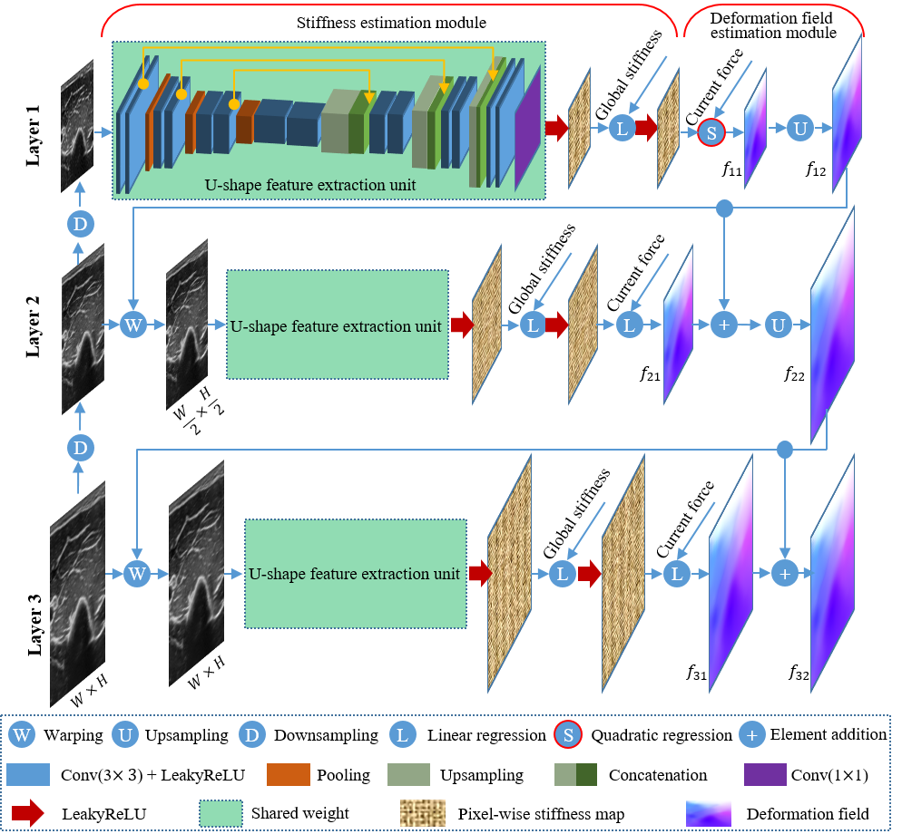

# DefCor-Net

## Bag Data Preprocessing


### 1. Data Preprocessing
**dataset/data_preprocessing.py** file does data preprocessing tasks, processed the data in defined root, and returns a dict to pair the information by timestamp, with force, image, and pose information.

### 2. Data pairing
**dataset/pairing.py** we can get the paired image with force and pose by linear assignment from timestamp.

### 3. Generate ground truth

**raft/generate_gt_stepwise.py** will generate gt flow between 2 frames. When the deformation is too large, we will use an intermediate frame to do a step-wise flow estimation.

## Network Details
<p align="center">

</p>

The code implementation of the network see **networks/c2f_stiff_second_network.py**

## How to use
```
python train.py --opt options/train_c2f_stiff_second.yaml
```

## Citation
The work has been Published in Medical Image Analysis
```
@article{jiang2023defcor,
  title={DefCor-Net: Physics-aware ultrasound deformation correction},
  author={Jiang, Zhongliang and Zhou, Yue and Cao, Dongliang and Navab, Nassir},
  journal={Medical Image Analysis},
  pages={102923},
  year={2023},
  publisher={Elsevier}
}
```

A previous study focused on ultrasound image correction was published in RAL 2021
```
@article{jiang2021deformation,
  title={Deformation-aware robotic 3D ultrasound},
  author={Jiang, Zhongliang and Zhou, Yue and Bi, Yuan and Zhou, Mingchuan and Wendler, Thomas and Navab, Nassir},
  journal={IEEE Robotics and Automation Letters},
  volume={6},
  number={4},
  pages={7675--7682},
  year={2021},
  publisher={IEEE}
}
```
